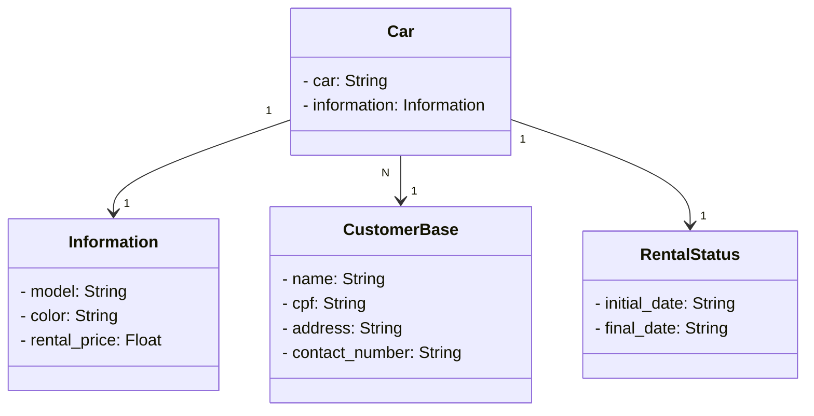

# dev-week-23
Sistema de aluguéis de carro

## Diagrama de Classes

```mermaid
classDiagram
    class Car {
        - car: String
        - information: <link>Information</link>
    }
    
    class Information {
        - model: String
        - color: String
        - rental_price: Float
    }
    
    class CustomerBase {
        - name: String
        - cpf: String
        - address: String
        - contact_number: String
    }
    
    class RentalStatus {
        - initial_date: String
        - final_date: String
    }
    
    Car "1"-->"1" Information
    Car "N"-->"1" CustomerBase
    Car "1"-->"1" RentalStatus
```
